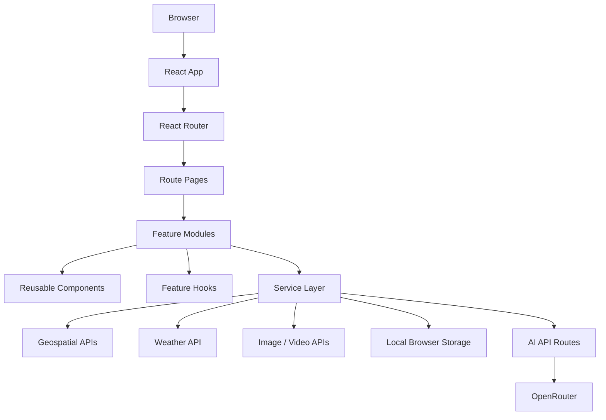
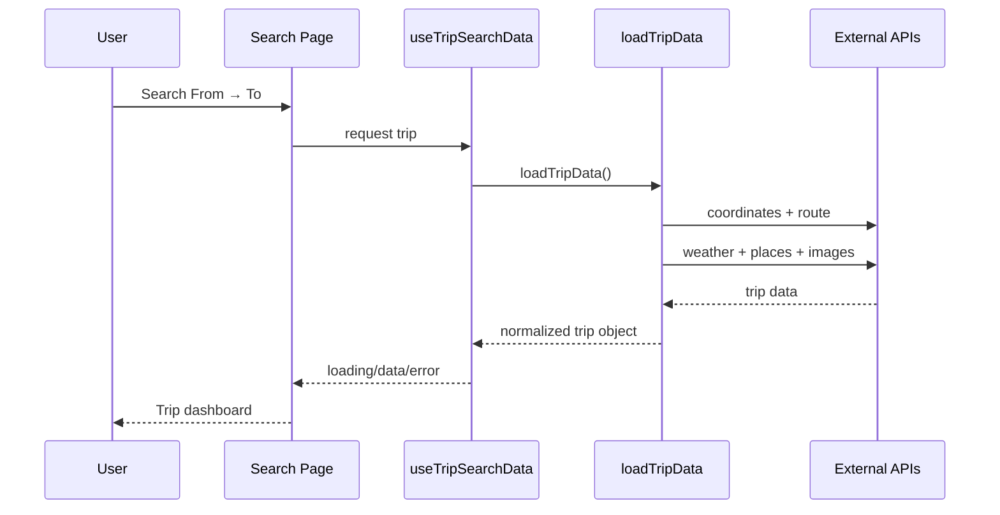

# 🌍 TripDNA AI

> **Plan Smarter. Travel Better.**

TripDNA AI is a React + Vite travel-planning application that combines route planning, weather, nearby places, travel options, budgets, favorites, saved trips and AI-powered itinerary generation in one workflow.

## ✨ What it includes

- 🗺️ Route and map visualization
- 📍 Location autocomplete and geocoding
- 🌤️ Current weather and forecast
- 🏨 Hotels, 🍽 restaurants and 📍 attractions
- 🏥 Nearby essential services
- 🚗 Travel-mode comparison
- 💰 Trip budget estimation
- 🤖 AI itinerary generation
- 💬 AI travel assistant
- ❤️ Favorites and saved trips
- 📄 PDF itinerary export
- 🔊 Text-to-speech itinerary
- 📤 Native trip sharing
- 📱 Responsive navigation
- 🚫 React/Vercel 404 handling

## 🧠 Architecture



## 📁 Refactored structure

```text
TripDNA-AI/
├── api/
│   └── ai/
│       ├── chat.js
│       └── trip-plan.js
├── public/
│   ├── favicon.svg
│   └── icons.svg
├── src/
│   ├── app/
│   │   └── App.jsx
│   ├── config/
│   │   └── constants.js
│   ├── features/
│   │   └── search/
│   │       ├── components/SearchResults.jsx
│   │       ├── hooks/useTripSearchData.js
│   │       ├── services/loadTripData.js
│   │       └── utils/recentSearches.js
│   ├── components/
│   │   ├── ai/
│   │   ├── discovery/
│   │   ├── home/
│   │   ├── layout/
│   │   ├── search/
│   │   └── trip/
│   ├── lib/
│   │   └── firebase.js
│   ├── pages/
│   │   ├── Favorites.jsx
│   │   ├── Home.jsx
│   │   ├── NotFound.jsx
│   │   ├── Profile.jsx
│   │   ├── SavedTrips.jsx
│   │   ├── Search.jsx
│   │   └── TripDetails.jsx
│   └── services/
│       ├── ai/
│       ├── geospatial/
│       ├── media/
│       ├── storage/
│       ├── travel/
│       └── weather/
├── vercel.json
├── index.html
├── package.json
└── vite.config.js
```

## 📦 Responsibility map

| Folder | Responsibility |
| --- | --- |
| src/app | Application shell and route registration |
| src/pages | Route-level screens |
| src/components | Reusable UI grouped by domain |
| src/features | Feature-specific orchestration, hooks and utilities |
| src/services | External APIs, storage and domain calculations |
| src/config | Shared application constants |
| src/lib | Third-party SDK initialization |
| api | Server-side AI endpoints for Vercel |

## 🔄 Search flow



## 🔐 Environment variables

Client integrations use VITE_* variables.

AI credentials used by the Vercel API routes should be stored as:

```env
OPENROUTER_API_KEY=...
```

Do not commit .env files or secrets.

## 🚀 Local development

```bash
npm install
npm run dev
npm run build
npm run lint
```

## ☁️ Deployment

The frontend is a Vite SPA deployed through Vercel. vercel.json rewrites browser routes to index.html so React Router can handle application routes and the custom 404 route.

## 🧹 Refactor principles

- Pages handle route-level composition.
- Feature hooks own reusable stateful workflows.
- Feature services coordinate multi-API operations.
- Components are grouped by UI/domain responsibility.
- External integrations live in service modules.
- AI credentials are handled by server-side API routes.
- Legacy paths are kept as tiny re-export shims where useful for compatibility.

## ⚠️ Known limitations

- External APIs can fail or rate-limit.
- Some third-party API keys are necessarily used from the browser and should be restricted by provider settings.
- Saved trips and favorites use browser localStorage.
- The application currently has no complete automated test suite.
- AI output should be treated as generated guidance rather than guaranteed real-time travel facts.
